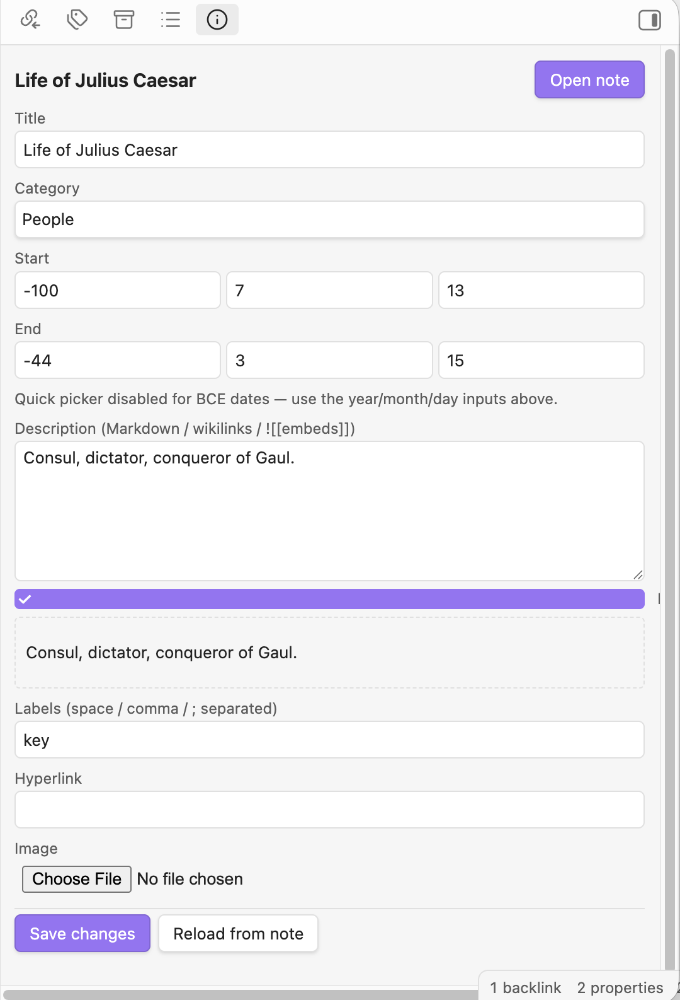
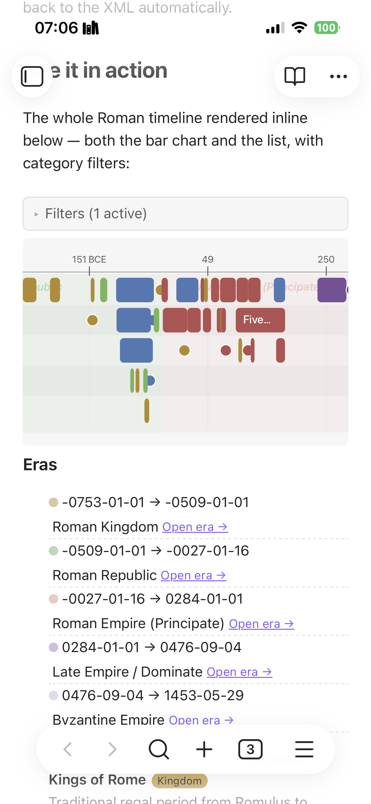

# Timeline XML Sync

**Two-way sync** between [Timeline Project](http://thetimelineproj.sourceforge.net/) `.timeline` XML save files and Obsidian Markdown notes — plus inline ` ```timeline ` render blocks so your timeline lives inside your vault, not in a separate app.

Built mobile-first: only uses the Obsidian Vault API. Same plugin runs on desktop, iPad, iPhone.

<p align="center">
  
</p>

---

## What it does

- **Edit your timeline like notes.** One Markdown note per event. Rename, link, embed, tag, search with the rest of your vault.
- **Drop a timeline into any note.** A fenced ` ```timeline ` block renders a scrollable bar + list inline, with filter chips above it.
- **Round-trip with the desktop app.** Open the same `.timeline` file in Timeline Project for advanced editing; the plugin re-imports without losing data.
- **BCE-safe.** Negative years (`-753` = founding of Rome) compare correctly. No JavaScript `Date`.
- **Multi-device safe.** Designed for vaults synced via [Remotely Save](https://github.com/remotely-save/remotely-save) / Obsidian Sync / Nextcloud / iCloud — with mtime CAS guards on writes, per-note edit stamps, and backups before any destructive op. See [docs/multi-device-sync.md](docs/multi-device-sync.md).

## Screenshots

| Inline ` ```timeline ` block (hybrid mode) | Global Timeline view |
| --- | --- |
|  |  |

| Right-sidebar Inspector | Settings: multi-device sync |
| --- | --- |
|  |  |

| Eras as background bands | Mobile (iPad / iPhone) |
| --- | --- |
|  |  |

---

## Try it in 60 seconds

A pre-built demo vault ships in this repo with a Roman timeline (753 BCE → 1453 CE).

1. Install the plugin (see [docs/install.md](docs/install.md)).
2. **Open another vault → Open folder as vault** → pick this repo's [`demo-vault/`](demo-vault/) folder.
3. Enable **Timeline XML Sync** under **Community plugins**.
4. Run the command **Timeline XML Sync: Import XML to Markdown event notes**.
5. Open `Welcome.md`. The bar + list render inline.

Then poke at:

- [`Tour - Republic.md`](demo-vault/Tour%20-%20Republic.md) — viewport-scoped embed (block narrows to one era).
- [`Tour - Caesar.md`](demo-vault/Tour%20-%20Caesar.md) — block with its own `range:` filter inside prose.
- [`Tour - Filters and embeds.md`](demo-vault/Tour%20-%20Filters%20and%20embeds.md) — category/label/range filters, vertical bar, embedded notes.

---

## Install

The plugin ships three files: `manifest.json`, `main.js`, `styles.css`.

- **Desktop**: drop them in `.obsidian/plugins/timeline-xml-sync/` and enable in Community plugins.
- **Mobile**: use [BRAT](https://github.com/TfTHacker/obsidian42-brat) and add the beta plugin `davadev/obsidian_timeline`.

Full instructions for every sync setup (Obsidian Sync, Syncthing, Remotely Save, iCloud, manual file-app drop, a-Shell): **[docs/install.md](docs/install.md)**.

---

## About Timeline Project

The companion desktop application this plugin syncs with is **Timeline Project** — a free open-source timeline editor written in Python/wxWidgets.

- Homepage / download: <http://thetimelineproj.sourceforge.net/>
- Source code: <https://sourceforge.net/projects/thetimelineproj/>
- Documentation: <https://thetimelineproj.sourceforge.net/docs/contents.html>

Built and tested against **Timeline 2.11** save files. The XML parser is defensive — unknown attributes and child elements survive round-trips — so other versions are likely to work, but only 2.11 is verified.

---

## Documentation

| Topic | File |
| --- | --- |
| Install (desktop + iOS + Android + from-source) | [docs/install.md](docs/install.md) |
| Settings reference | [docs/settings.md](docs/settings.md) |
| Markdown event-note schema | [docs/markdown-schema.md](docs/markdown-schema.md) |
| ` ```timeline ` render block options | [docs/render-block.md](docs/render-block.md) |
| Commands + ribbon + auto-sync | [docs/commands.md](docs/commands.md) |
| XML compatibility notes | [docs/xml-compatibility.md](docs/xml-compatibility.md) |
| Multi-device sync safety (Nextcloud / Remotely Save / iCloud) | [docs/multi-device-sync.md](docs/multi-device-sync.md) |
| Architecture, testing, project layout | [docs/architecture.md](docs/architecture.md) |

---

## Privacy

The example file path `./Timeline2_11.timeline` (the maintainer's personal save) is in `.gitignore` and never read by tests or shipped fixtures. Tests use the synthetic `tests/fixtures/sample.timeline` and the public `demo-vault/timelines/Rome.timeline` only.

## License

MIT.
