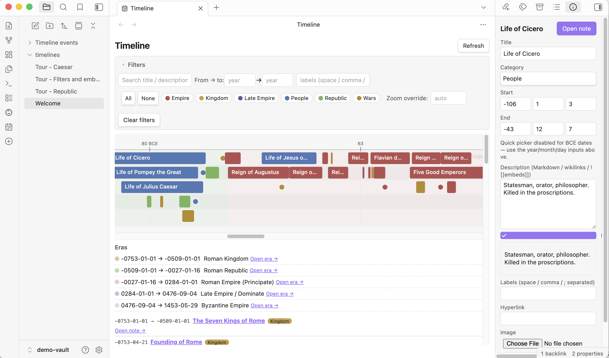

# Commands

All commands are prefixed `Timeline XML Sync:` in the command palette.

<p align="center">
  
</p>

The workspace **Timeline view** (above) is opened via the ribbon icon or the **Open Timeline view** command. The right-sidebar **Inspector** is opened by clicking an event in any bar/list, or via **Open Timeline inspector**.

| Command | Effect |
| --- | --- |
| Import XML to Markdown event notes | First import or re-import. Skips notes locally edited since the last XML-driven write (the `last_synced_xml_mtime` stamp). |
| Validate all timeline event notes | Surfaces validation errors in the Diagnostics section / console. |
| Regenerate XML from Markdown | Refuses to write if any event note is invalid, or if the XML changed externally since the last read (mtime CAS guard). |
| New timeline event (prompt + open inspector) | Recommended way to create new events. Prompts for a title, creates the MD note, opens the right-sidebar Inspector. |
| New era (prompt + open inspector) | Same for era bands. |
| Insert timeline view block at cursor | Drops a default ` ```timeline ` block at the editor cursor. |
| Open Timeline view | Opens the workspace-leaf global view (like the Graph view). |
| Open Timeline inspector | Opens the right-sidebar Inspector — edit any event/era without leaving the note. |
| Auto-detect .timeline XML file (scan vault) | Walks the vault for `.timeline` files and configures the plugin to use the one it finds. |
| Auto-detect event notes (scan vault) | Finds notes with `timeline.enabled: true` and configures the event notes directory + timeline id from them. |
| Wipe event notes and reimport from XML | Backs up the XML AND every MD note (under `_backups/wipe-<ts>/`), then deletes and reimports. Used to baseline notes after a schema bump, or to recover from drift. |
| Create/Update event note template | Writes a template the core Templates plugin can insert (legacy — prefer "New timeline event"). |
| Open timeline sync diagnostics | Dumps current diagnostics to the developer console. |
| Rebuild internal index/cache | Re-runs validation + refreshes in-memory diagnostics. |
| Export note: render timelines to images | Walks the active note for ` ```timeline ` blocks, renders each to a PNG via the browser canvas, writes the image into the vault, and replaces the fenced block with the image + a static list. |
| Re-enable after crash (clear crash flag) | Only registered when the plugin auto-disabled itself after a crash. Clears the flag so it loads next time. |

## Zooming the Timeline view

The time axis is scaled to fit by default. To look closer:

- **Touch** — pinch with two fingers anywhere on the timeline. The point between
  your fingers stays put.
- **Desktop** — pinch on the trackpad, or hold <kbd>Ctrl</kbd> and scroll. The
  point under the cursor stays put.
- **Buttons** — `−` / `+` in the view header. The label between them shows the
  current factor (`Auto` while it is being fitted automatically); click it to go
  back to automatic.

The axis re-scales with the zoom: fitted out it marks centuries, zoomed in it
moves to decades, years, months and finally individual days, so a label near
the pointer always says where you are.

Zoom runs from 0.25× (fitted out) to 2000×. Very deep zoom is bounded by a
pixel cap on the rendered axis (`MAX_AXIS_PX` in `src/renderer/zoom-math.ts`,
1 000 000 px — roughly 340 px per year across two millennia, enough for the
axis to name months on a span that long), so the chart stops growing before a
device has to paint something it cannot.

Zoom is a view setting, not a filter: it is not counted in the Filters badge,
though **Clear filters** does reset it to automatic. Inline ` ```timeline `
blocks keep their own `zoom:` option — see
[render-block.md](./render-block.md).

## Ribbon

Two ribbon icons:

- **Open Timeline view** — opens the global view in a new tab.
- **Timeline actions…** — opens a SuggestModal-style picker with New event / New era / Insert block. Keeps the ribbon to one icon.

## Auto-sync

Enabled by default. Any MD change inside the event notes directory triggers a debounced regenerate (default 60s debounce). You can:

- Disable globally in settings.
- Override per-device under **Auto-sync on this device** (stored in `localStorage`, does NOT sync with the vault — set Off on devices that shouldn't write to XML).
