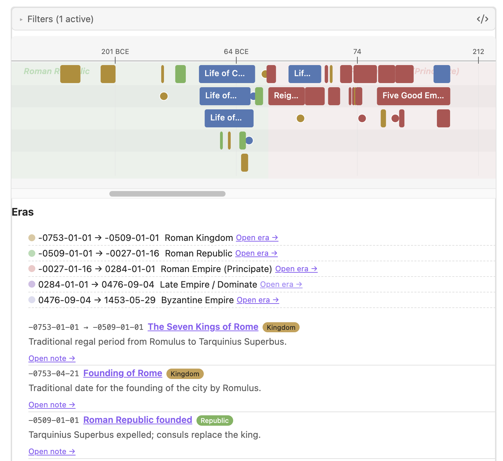

# Render block reference

Drop one of these into any note:

````markdown
```timeline
mode: hybrid
source: main
```
````

The plugin renders the block in place. Embedded notes work too — `![[Some Note]]` carries the host's frontmatter viewport with it.

<p align="center">
  
</p>

## Options

| Option | Type | Default | Notes |
| --- | --- | --- | --- |
| `mode` | `bar` / `list` / `hybrid` | `hybrid` | Visual + textual. |
| `source` | string | `main` | Logical id (matches `timeline.id`). |
| `sourceXml` | string | _(settings)_ | Override XML path for this block. |
| `details` | `list` / `compact` / `table` / `cards` | `list` | At least `list` and `compact` are implemented. |
| `sort` | `chronological` / `reverse-chronological` / `category` | `chronological` | |
| `show` | list | `[title,date,category,description]` | Fields rendered next to each event in the textual view. |
| `categories.include` / `.exclude` | list | _(empty)_ | Category name filter. |
| `labels.include` / `.exclude` | list | _(empty)_ | Label filter (events tagged with any of these). |
| `range` | `[fromYear, toYear]` | _(none)_ | Year-range filter. Inclusive at both ends. |
| `search` | string | _(empty)_ | Case-insensitive substring match over title/description/category. |
| `event` / `events` | string / list | _(none)_ | Show only events whose title contains one of these substrings. |
| `zoom` | number | `1` | Time-axis scale. `2` = 2× wider with horizontal scroll. |
| `stickyLabels` | boolean | `true` | Slide an event's label along its bar while scrolling so a long span still shows its name. `false` pins it to the bar's start. |
| `orientation` | `horizontal` / `vertical` | `horizontal` | Vertical reads top→bottom; lanes become columns. |
| `pointPaddingYears` | number | _(settings)_ | Years padded on each side of a single-point viewport. |
| `viewport` | boolean | _(omitted)_ | See **Viewport** below. |
| `showFilterUI` | boolean | `true` | Toggle the collapsible Filters panel above the block. |

## Viewport

The Filters panel above the block (or hard-coded YAML) always wins. Below that, viewport precedence is:

1. Block YAML `viewport: true` → use the host note's `timeline.start` / `timeline.end` as viewport.
2. Block YAML `viewport: false` → never use the host's viewport.
3. Omitted → use the host's viewport **only when** the host has `timeline.role: viewport`.

When a viewport applies:

- Events shown overlap the viewport (inclusive).
- The bar's time axis scales to the viewport.
- Eras (background bands) are filtered to the same viewport.

Auto-generated event notes ship a `viewport: true` block by default so the inline timeline is scoped to the event's neighbourhood instead of spanning every era on the timeline. Blocks you insert manually via **Timeline actions → Insert timeline view block** omit `viewport:` so they behave like the global view.

## Filters panel

Every inline block (and the global view) carries the same Filters panel — collapsed by default. It writes its state into the block's YAML on every change, so filters travel with the note across devices.

If you ever see "No events to display" inside an inline block: expand the panel and click **Clear filters**.

## Hybrid mode interaction

In `mode: hybrid` both the SVG bar and the textual list render. Each event in the list is a link that opens the note (or the right-sidebar Inspector, depending on the **Click behavior** setting).
